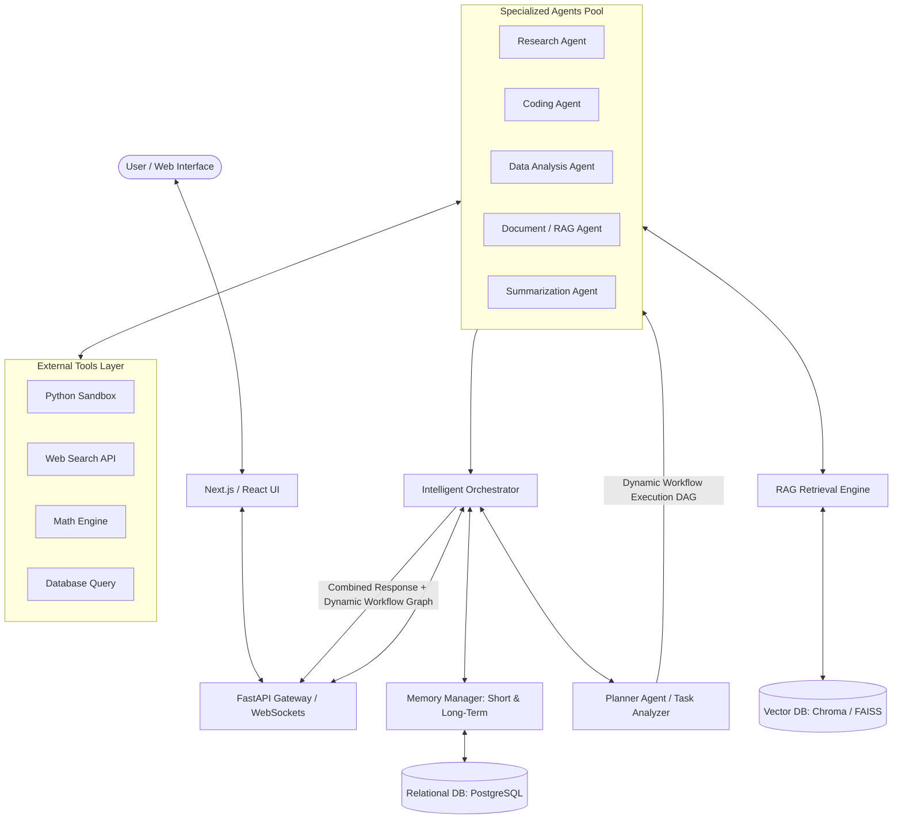

# AgentVerse: A Generic Multi-Agent Artificial Intelligence System

[](https://www.python.org/)
[](https://fastapi.tiangolo.com/)
[](https://nextjs.org/)
[](LICENSE)

**AgentVerse** is a generic, context-aware, and explainable multi-agent artificial intelligence framework. Unlike single-agent chatbots or hardcoded agent pipelines, AgentVerse dynamically analyzes user requests using a central **Planner Agent**, decomposes complex tasks, dynamically routes execution across specialized agents, leverages **RAG** and **Short/Long-Term Memory**, executes external tools, and presents dynamic workflow visualizers in real-time.

---

## 🌟 Core System Architecture & Logic Flow



---

## 🧠 Core System Logic & Workflow Execution

1. **User Query Ingestion**: The user submits a natural language request or uploads a document via the Next.js frontend to the FastAPI gateway.
2. **Intent Analysis & Task Decomposition**:
   - The query is forwarded to the **Planner Agent**.
   - The Planner evaluates:
     - User intent and requirements.
     - Which specialized agents are needed.
     - Whether document retrieval (RAG) is required.
     - Whether conversation memory context is required.
     - Whether external execution tools (e.g., Python sandbox, Web Search) are required.
3. **Dynamic Workflow Generation (DAG)**:
   - Rather than relying on a hardcoded sequence, the system constructs a dynamic Directed Acyclic Graph (DAG) for execution paths:
     - **Simple Informational Query**: Query $\rightarrow$ Planner $\rightarrow$ Summarizer / General Agent $\rightarrow$ Response.
     - **Document Inquiry**: Query $\rightarrow$ Planner $\rightarrow$ RAG Engine $\rightarrow$ Document Agent $\rightarrow$ Response.
     - **Data Computation**: Query $\rightarrow$ Planner $\rightarrow$ Data Analysis Agent $\rightarrow$ Python Sandbox Tool $\rightarrow$ Response.
     - **Complex Research**: Query $\rightarrow$ Planner $\rightarrow$ Research Agent + Document Agent $\rightarrow$ Data Agent $\rightarrow$ Orchestrator Aggregation $\rightarrow$ Response.
4. **Intelligent Orchestration & Execution**:
   - The **Orchestrator** acts as the central controller managing state handshakes, agent scheduling, tool execution, conflict resolution, and final output synthesis.
5. **Memory & Context Ingestion**:
   - **Short-Term Memory**: Captures active session dialogue context in sliding windows.
   - **Long-Term Memory**: Stores vectorized past user interactions for semantic retrieval and context-aware responses.
6. **Explainable AI Visualization**:
   - The execution steps, active agents, tool parameters, and timing metrics are streamed live to the frontend **Dynamic Workflow Viewer** (React Flow).

---

## 🤖 Specialized Agents Suite

Each agent in AgentVerse is modular, extending a unified `BaseAgent` abstraction:

| Agent | Responsibilities | Capabilities & Tools |
| :--- | :--- | :--- |
| **Planner Agent** | Query decomposition & dynamic workflow graph generation | Intent classification, JSON DAG output |
| **Research Agent** | Information gathering & web synthesis | Web Search API, domain summarization |
| **Coding Agent** | Code generation, syntax checking & refactoring | Code formatting, Python/JS syntax verifier |
| **Data Analysis Agent** | CSV/JSON processing & statistical computing | Python Sandbox Tool, pandas, numpy |
| **Document / RAG Agent** | Deep document questioning & context extraction | Vector store retriever, document chunking |
| **Summarization Agent** | Text condensation & multi-source synthesis | Text summarization, report formatting |

---

## 🛠️ External Tools Execution Layer

AgentVerse equips agents with sandboxed external tool capabilities (`BaseTool`):

- **Python Sandbox Exec**: Runs isolated Python code snippets for statistical analysis and calculations.
- **Web Search**: Queries real-time external search APIs for up-to-date web information.
- **Calculator / Math Engine**: Executes precision mathematical calculations.
- **Database Query**: Performs read-only queries against structured PostgreSQL data.
- **File Parser**: Ingests and cleans PDF, CSV, DOCX, and TXT files.

---

## 📂 System Project Structure

```directory
AgentVerse/
├── README.md               # Master system documentation & logic overview
├── docs/                   # System design & implementation plans
│   └── AgentVerse_Implementation_Plan.md
├── backend/                # FastAPI API gateway, REST & WebSocket routes
├── agents/                 # Specialized agents & dynamic orchestrator engine
│   ├── orchestrator/       # Central orchestrator & DAG state execution manager
│   ├── planner/           # Planner agent (intent analysis & DAG generator)
│   ├── rag/               # Document ingestion, embeddings & RAG retriever
│   ├── evaluation/        # Benchmarking & performance evaluation framework
│   └── pool/              # Specialized agents pool (Research, Coding, Data, Summary)
├── memory/                 # Short-term (sliding context) & Long-term (vectorized) memory
├── tools/                  # External tools execution sandbox (Python, Web Search, Math, DB)
├── database/               # Relational ORM models (PostgreSQL) & Vector store clients (Chroma/FAISS)
├── frontend/               # Next.js / React frontend UI, Chat Dashboard & Workflow Visualizer
└── tests/                  # Integration and unit test suite
```

---

## 🛠️ Technology Stack

| Domain | Technology |
| :--- | :--- |
| **Frontend UI** | React / Next.js, Tailwind CSS, React Flow (Workflow Visualizer) |
| **Backend Gateway** | FastAPI, Python 3.10+, Uvicorn, WebSockets |
| **LLMs Engine** | Mistral / Llama (Ollama / vLLM / OpenRouter API) |
| **Orchestrator Framework** | Custom Dynamic Orchestrator / LangGraph |
| **RAG & Embeddings** | Sentence-Transformers + ChromaDB / FAISS |
| **Databases & Memory** | PostgreSQL, pgvector, SQLAlchemy |
| **DevOps & Containers** | Docker, Docker Compose, GitHub Actions |

---

## 🚀 Getting Started

### Prerequisites
- Python 3.10+
- Node.js 18+
- Docker & Docker Compose (Optional)

### 1. Backend Service Setup
```bash
# Navigate to backend directory
cd backend

# Create & activate Python virtual environment
python -m venv venv
source venv/bin/activate  # On Windows: venv\Scripts\activate

# Install backend dependencies
pip install -r requirements.txt

# Launch FastAPI development server
uvicorn main:app --reload --port 8000
```

### 2. Frontend Application Setup
```bash
# Navigate to frontend directory
cd frontend

# Install Node dependencies
npm install

# Launch Next.js web dashboard
npm run dev
```

Open `http://localhost:3000` to interact with the **AgentVerse** Chat Interface & Dynamic Workflow Visualizer.

---

## 📜 License

This project is licensed under the MIT License - see the [LICENSE](LICENSE) file for details.
