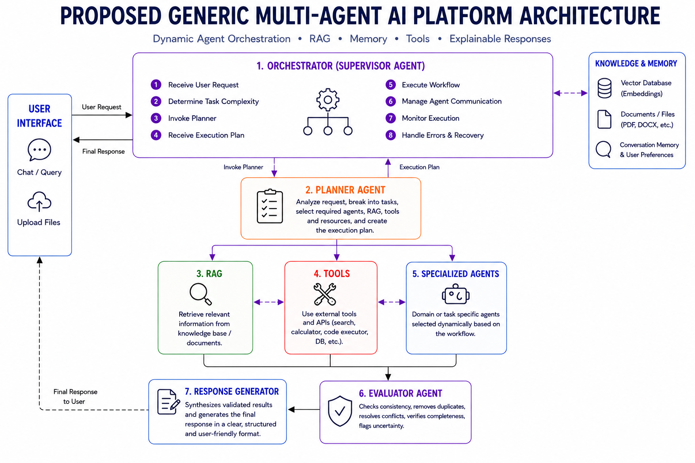
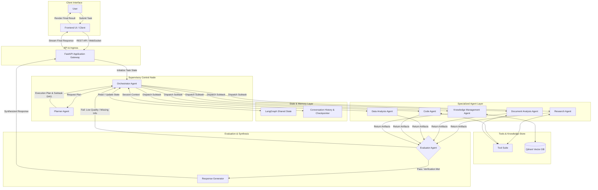
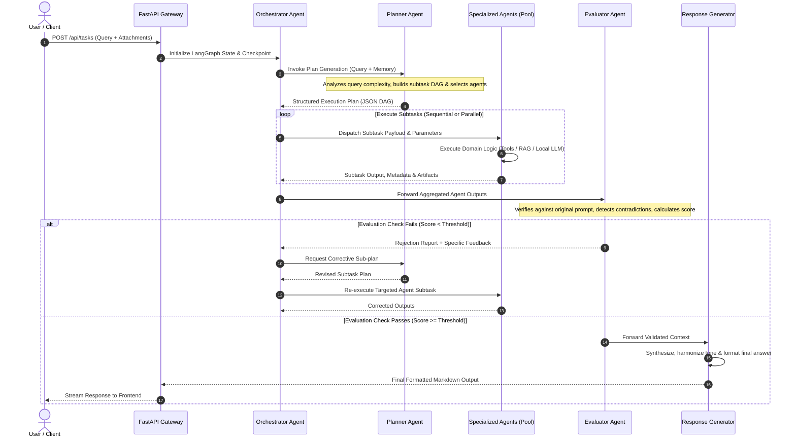

# Agentverse

Agentverse is a generic, domain-independent multi-agent artificial intelligence platform designed to dynamically orchestrate specialized agents, RAG, memory, and tools to solve diverse user tasks. Built with **LangGraph**, **FastAPI**, **LangChain**, and **Qdrant**, Agentverse can run entirely on-premise using local LLMs (via Ollama) across a standalone machine or a distributed multi-node LAN cluster without reliance on external cloud APIs.

---

## Table of Contents

- [Sprint-Wise Implementation Plan (4 Developers)](docs/sprint_plan.md)
- [Project Scope](#project-scope)
- [System Architecture](#system-architecture)
- [Workflow Diagrams](#workflow-diagrams)
  - [End-to-End System Workflow](#end-to-end-system-workflow)
  - [Runtime Sequence Flow & Feedback Loop](#runtime-sequence-flow--feedback-loop)
- [Detailed Agent Logic](#detailed-agent-logic)
  - [1. Orchestrator Agent (Supervisor)](#1-orchestrator-agent-supervisor)
  - [2. Planner Agent](#2-planner-agent)
  - [3. Research Agent](#3-research-agent)
  - [4. Document Analysis Agent](#4-document-analysis-agent)
  - [5. Data Analysis Agent](#5-data-analysis-agent)
  - [6. Code Agent](#6-code-agent)
  - [7. Knowledge Management / RAG Agent](#7-knowledge-management--rag-agent)
  - [8. Evaluator Agent (Quality Control)](#8-evaluator-agent-quality-control)
  - [9. Response Generator](#9-response-generator)
- [Distributed Multi-Node LAN Deployment](#distributed-multi-node-lan-deployment)
- [Technology Stack](#technology-stack)
- [Repository File Structure](#repository-file-structure)
- [Getting Started](#getting-started)

---

## Project Scope


---

## System Architecture



---

## Workflow Diagrams

### End-to-End System Workflow

The following flowchart illustrates how requests enter the system, how the supervisor and planner decompose tasks, how specialized agents access tools and vector storage, and how the evaluator enforces quality control:



---

### Runtime Sequence Flow & Feedback Loop

The sequence below depicts step-by-step messaging, state transitions, subtask execution, and the dynamic feedback loop triggered when the Evaluator detects inconsistencies:



---

## Detailed Agent Logic

Each agent in Agentverse is engineered as an autonomous node with dedicated decision rules, input-output schemas, and specialized prompt engineering within the LangGraph state machine.

```
+-----------------------------------------------------------------------------+
|                               Agentverse Registry                           |
+----------------------+--------------------+---------------------------------+
| Agent Name           | Core Model Type    | Primary Function                |
+----------------------+--------------------+---------------------------------+
| Orchestrator         | Supervisor / Router| Workflow state, routing, recovery|
| Planner              | Reasoning LLM      | Task decomposition, DAG planning|
| Research             | Tool-calling LLM   | Web queries, fact gathering     |
| Document Analysis    | Long-context LLM   | PDF parsing, chunk analysis     |
| Data Analysis        | Code/Math LLM      | Tabular processing, statistics  |
| Code Agent           | Code LLM           | Code synthesis, debugging, tests|
| Knowledge Management | Embedding + LLM    | Qdrant semantic retrieval, RAG  |
| Evaluator            | Critic / Judge LLM | Contradiction check, scoring    |
| Response Generator   | Synthesis LLM      | Final formatting, deduplication |
+----------------------+--------------------+---------------------------------+
```

---

### 1. Orchestrator Agent (Supervisor)

The **Orchestrator** is the central controller of the execution graph. It maintains global state consistency, dispatches subtasks to agent nodes, and monitors overall execution lifecycle.

- **Objective:** Manage execution flow, coordinate agent dispatching, track lifecycle, and handle errors.
- **Internal Logic & Algorithm:**
  1. **Request Ingestion & State Initialization:** Receives the user request, generates a unique `task_id` and `session_id`, and loads chat history from `memory/history.py` into `memory/state.py`.
  2. **Complexity Assessment:** Determines if the query requires multi-agent decomposition (complex/multi-part) or direct single-agent routing.
  3. **Planner Invocation:** Calls the Planner Agent to generate an executable Directed Acyclic Graph (DAG) of subtasks.
  4. **Task Dispatcher:** Iterates through planned subtasks. For tasks with no dependencies, executes in parallel; for dependent tasks, awaits antecedent completion and injects upstream artifacts.
  5. **Fault Recovery:** Catches agent timeouts, HTTP connection drops (in distributed mode), or unparsable payloads, applying retry policies (up to 3 attempts) or falling back to alternative agents.
  6. **Evaluation Routing:** Sends completed subtask outputs to the Evaluator Agent before finalizing.
- **Inputs:** `user_query`, `session_id`, `attachments`, `history`.
- **Outputs:** Managed LangGraph state transitions, dispatches to agents, handoff to Evaluator.

---

### 2. Planner Agent

The **Planner Agent** breaks down unstructured user queries into a deterministic execution graph, matching each subtask with the optimal agent, toolset, and retrieval strategy.

- **Objective:** Analyze complex prompts, decompose them into modular subtasks, and define execution dependencies.
- **Internal Logic & Algorithm:**
  1. **Intent Classification:** Parses user constraints, desired output format, domain (code, documents, research, analytics), and complexity.
  2. **Subtask Decomposition:** Splits compound problems into atomic steps (e.g., *Step 1: Retrieve PDF text → Step 2: Extract financial figures → Step 3: Run regression model → Step 4: Validate with search*).
  3. **Capability Mapping:** Queries the Agent Registry to map each atomic step to the target agent node and required tool definitions.
  4. **Dependency Resolution:** Assigns execution order and identifies parallelizable vs. blocking branches.
  5. **Plan Serialization:** Emits a structured JSON execution plan containing:
     - `step_id`: Identifier for the step.
     - `target_agent`: Designated agent (e.g., `research`, `document`, `code`).
     - `required_tools`: List of tools required.
     - `dependencies`: List of antecedent `step_id`s.
     - `subtask_instruction`: Explicit prompt tailored for the specialized agent.
- **Inputs:** `user_query`, `available_agent_registry`, `session_context`.
- **Outputs:** `ExecutionPlan` JSON schema.

---

### 3. Research Agent

The **Research Agent** conducts autonomous web discovery, information retrieval, and multi-source cross-referencing.

- **Objective:** Retrieve factual, up-to-date external knowledge and compile synthesized research briefs.
- **Internal Logic & Algorithm:**
  1. **Query Generation:** Transforms broad research goals into optimized keyword and Boolean search queries.
  2. **Tool Invocation:** Calls search tools (e.g., DuckDuckGo, SearxNG) and fetches content from relevant pages.
  3. **Scraping & Cleaning:** Strips HTML boilerplate, scripts, and advertisements, preserving only relevant text.
  4. **Fact Triangulation:** Compares facts across multiple domains to prevent hallucinations from isolated sources.
  5. **Synthesis:** Compiles a bulleted research summary accompanied by canonical URLs and source attribution.
- **Tools Used:** `search_tools.py` (Web Search, URL Content Reader, Browser Engine).
- **Outputs:** `research_brief`, `sources` (list of URLs/titles), `key_findings`.

---

### 4. Document Analysis Agent

The **Document Analysis Agent** inspects, parses, and extracts insights from unstructured and semi-structured documents (PDFs, DOCX, TXT).

- **Objective:** Parse complex documents, summarize key points, extract structured data, and answer document-grounded queries.
- **Internal Logic & Algorithm:**
  1. **File Ingestion:** Leverages LangChain document loaders (`document_tools.py`) to parse document files.
  2. **Chunking & Pre-filtering:** Applies recursive character splitters with semantic boundaries to segment long files while preserving context.
  3. **Section Identification:** Categorizes sections (e.g., executive summary, financials, legal clauses, methodologies).
  4. **Targeted Extraction:** Uses zero-shot and few-shot extraction to pull key figures, entities, tables, and themes.
  5. **Grounded Summarization:** Summarizes content strictly from source passages, eliminating speculation.
- **Tools Used:** `document_tools.py` (PyPDF, PDFPlumber, Unstructured, TextSplitter).
- **Outputs:** `document_summary`, `extracted_entities`, `page_references`.

---

### 5. Data Analysis Agent

The **Data Analysis Agent** performs computational and statistical operations on structured datasets (CSV, Excel, JSON, SQLite).

- **Objective:** Process structured datasets, execute statistical analyses, compute metrics, and prepare visualizations.
- **Internal Logic & Algorithm:**
  1. **Schema Inspection:** Reads dataset headers, datatypes, missing value counts, and statistical distributions.
  2. **Query / Script Generation:** Generates Python (Pandas/NumPy) or SQL code to execute transformations, aggregations, and metrics calculations.
  3. **Execution Sandbox:** Runs the computation inside a safe code execution environment (`code_tools.py`).
  4. **Visualization Generation:** Generates chart scripts (Matplotlib/Seaborn/Plotly) or precomputed tables.
  5. **Interpretation:** Translates raw figures into textual analytical insights highlighting trends, outliers, and correlations.
- **Tools Used:** `code_tools.py` (Python REPL sandbox, Pandas, NumPy), SQL connectors.
- **Outputs:** `analysis_report`, `statistical_summary`, `generated_plots` (base64/paths).

---

### 6. Code Agent

The **Code Agent** handles software development tasks, including code synthesis, refactoring, debugging, and repository analysis.

- **Objective:** Produce tested, production-grade code, debug existing snippets, and review implementation logic.
- **Internal Logic & Algorithm:**
  1. **Requirement Analysis:** Determines language, framework, dependencies, and functional constraints.
  2. **Code Generation:** Synthesizes idiomatic, modular code with complete error handling, typing, and docstrings.
  3. **Static & Syntax Validation:** Runs linters or AST parsers to ensure no syntax errors exist.
  4. **Test Synthesis & Execution:** Generates unit tests (e.g., `pytest`) and tests the code in a sandboxed runner.
  5. **Debugging Loop:** If execution fails, analyzes stderr tracebacks, applies patches, and re-tests until passing.
- **Tools Used:** `code_tools.py` (Isolated execution sandbox, static analyzer, linter).
- **Outputs:** `source_code`, `test_cases`, `execution_output`, `dependency_manifest`.

---

### 7. Knowledge Management / RAG Agent

The **Knowledge Management Agent** bridges user tasks with institutional memory and enterprise document collections.

- **Objective:** Provide high-precision contextual retrieval from internal vector stores and knowledge repositories.
- **Internal Logic & Algorithm:**
  1. **Query Embedding:** Encodes the retrieval query into vector representations using local embedding models (e.g., `nomic-embed-text`, `bge-m3`).
  2. **Vector Search:** Performs dense cosine similarity search with HNSW indexing against the **Qdrant** database (`database/qdrant_client.py`).
  3. **Metadata Filtering:** Constrains search spaces based on document date, department, tags, or access control lists.
  4. **Re-Ranking & Deduplication:** Re-scores retrieved passages using a cross-encoder to select top-$k$ most relevant context segments.
  5. **Context Augmentation:** Formats passages with explicit source IDs and injects them into downstream agent states.
- **Tools Used:** `database/qdrant_client.py`, LangChain vector store connectors, local embeddings via Ollama.
- **Outputs:** `retrieved_chunks`, `similarity_scores`, `provenance_metadata`.

---

### 8. Evaluator Agent (Quality Control)

The **Evaluator Agent** acts as an impartial quality gatekeeper, ensuring safety, factual adherence, and prompt compliance before output release.

- **Objective:** Verify outputs, detect hallucinations and contradictions, score answer quality, and gate final delivery.
- **Internal Logic & Algorithm:**
  1. **Compliance Verification:** Checks if all subtasks specified by the Planner have been resolved and answered.
  2. **Grounding & Contradiction Detection:** Cross-compares claims made by specialized agents against retrieved RAG chunks and research data to flag unsupported claims or hallucinations.
  3. **Quality Scoring Rubric:** Scores the aggregated response across 4 dimensions (0–100):
     - **Relevance:** Does it directly answer the user prompt?
     - **Factual Grounding:** Are facts substantiated by retrieved documents/tools?
     - **Completeness:** Are all sub-questions addressed?
     - **Format Compliance:** Does it adhere to requested formats (JSON, table, etc.)?
  4. **Conditional Decision Branch:**
     - **Pass ($\ge 80$):** Passes validated artifacts directly to the Response Generator.
     - **Fail ($< 80$):** Emits an evaluation defect report with actionable critique back to the Orchestrator for re-execution of specific subtasks.
- **Outputs:** `evaluation_status` (`APPROVED` / `REJECTED`), `quality_score`, `critique_feedback`.

---

### 9. Response Generator

The **Response Generator** transforms raw agent outputs and validated artifacts into an articulate, polished final answer.

- **Objective:** Synthesize multi-agent data into a unified, coherent, and user-friendly markdown response.
- **Internal Logic & Algorithm:**
  1. **Context Aggregation:** Pulls approved outputs from all contributing agents stored in the shared LangGraph state.
  2. **De-duplication:** Cleans redundant points and merges overlapping context across agents.
  3. **Styling & Tone Harmonization:** Formats text into clean GitHub-flavored markdown with clear headings, bullet points, callout blocks, code blocks, and data tables.
  4. **Citation & Reference Linking:** Appends a structured "References & Sources" section citing internal documents or external URLs used.
  5. **Stream Delivery:** Prepares output tokens for real-time WebSocket/SSE streaming back to the client interface.
- **Outputs:** `final_response_markdown`, `citations_list`.

---

## Distributed Multi-Node LAN Deployment

Agentverse is designed to run completely on-premise without external cloud services. The architecture can be distributed across 4 local machines connected through a private Local Area Network (LAN):

```text
                     WiFi Router / LAN Switch (Private Subnet)
                                       |
     ---------------------------------------------------------------------
     |                         |                         |               |
     |                         |                         |               |
 [Laptop A]                [Laptop B]                [Laptop C]      [Laptop D]
192.168.1.10              192.168.1.11              192.168.1.12    192.168.1.13
Research Node             Document Node             Analytics Node  Control Node
-----------------         -----------------         --------------  -----------------------
• Hardware:               • Hardware:               • Hardware:     • Hardware:
  RTX 3050 (6GB)            RTX 3050 (6GB)            RTX 3050 (6GB)  Integrated Graphics
• Model:                  • Model:                  • Model:        • Services:
  Qwen 2.5 / 3 (4B)         Qwen 2.5 / 3 (4B)         Qwen Coder 7B   FastAPI Web Gateway
• Agents:                 • Agents:                 • Agents:         Orchestrator Agent
  - Research Agent          - Document Analysis       - Data Analysis Planner Agent
• Endpoint:               • Endpoint:                 - Code Agent    Evaluator Agent
  POST /research            POST /document          • Endpoints:      Response Generator
                                                      POST /data      Qdrant Vector DB
                                                      POST /code      Agent Registry
```

### LAN Communication Architecture

- All nodes expose lightweight REST APIs using **FastAPI**.
- The **Control Node** maintains a dynamic `Agent Registry` containing node endpoints.
- All network packets stay strictly within `192.168.1.0/24`.
- **Zero data leakage:** Proprietary documents, vector embeddings, and conversation states never leave the local network.

---

## Technology Stack

- **Backend Framework:** FastAPI (Asynchronous high-performance REST & WebSocket gateway)
- **Agent Orchestration:** LangGraph (Stateful, multi-actor cyclic graphs with persistence)
- **Document Ingestion & Chunking:** LangChain (Document loaders, text splitters, RAG pipelines)
- **Vector Database:** Qdrant (Containerized via Docker, HNSW indexing, cosine similarity)
- **Local Language Models:** Ollama (Deploying tailored local models: Qwen 2.5/3, Llama 3, DeepSeek-Coder)
- **Memory Management:** Long-term conversation state persistence & checkpointing
- **Containerization:** Docker & Docker Compose

---

## Repository File Structure

```text
AgentVerse/
├── agents/                      # Specialized agent creation and LangGraph definitions
│   ├── orchestrator/            # Central coordinator LangGraph definitions (Supervises routing)
│   ├── planner/                 # Planner agent logic to break down tasks
│   ├── rag/                     # Knowledge management & RAG specialized agents
│   └── evaluation/              # Evaluator agent logic (verification and scoring)
├── backend/                     # FastAPI core backend application
│   ├── main.py                  # FastAPI application entry point
│   ├── api.py                   # API routes and endpoints definition
│   └── config.py                # Configuration (Models, Qdrant endpoints, API keys)
├── database/                    # Vector database configurations and scripts
│   ├── docker-compose.yml       # Qdrant vector database docker setup
│   └── qdrant_client.py         # Qdrant client interactions and connection handling
├── docs/                        # Project documentation (Architecture, Implementation Plan)
├── frontend/                    # Frontend UI application
├── memory/                      # Long-term memory and conversation state management
│   ├── state.py                 # LangGraph state definitions
│   └── history.py               # Saving and loading chat history
├── tests/                       # Automated tests (Functional, Multi-agent, RAG, Performance)
└── tools/                       # Tool definitions for LangGraph agents
    ├── search_tools.py          # Web search utilities
    ├── code_tools.py            # Code execution environments
    └── document_tools.py        # LangChain ingestion and chunking logic
```

---

## Getting Started

### Prerequisites

- Python 3.10+ installed
- Docker & Docker Compose (for Qdrant Vector DB)
- Ollama installed locally (or across nodes)

### 1. Clone the Repository
```bash
git clone https://github.com/abccau/AgentVerse.git
cd AgentVerse
```

### 2. Environment Configuration
Copy the example environment file and configure local parameters:
```bash
cp env.example .env
```

### 3. Start Qdrant Vector Database
```bash
cd database
docker compose up -d
cd ..
```

### 4. Install Dependencies & Launch Backend
```bash
pip install -r requirements.txt
uvicorn backend.main:app --host 0.0.0.0 --port 8000 --reload
```
