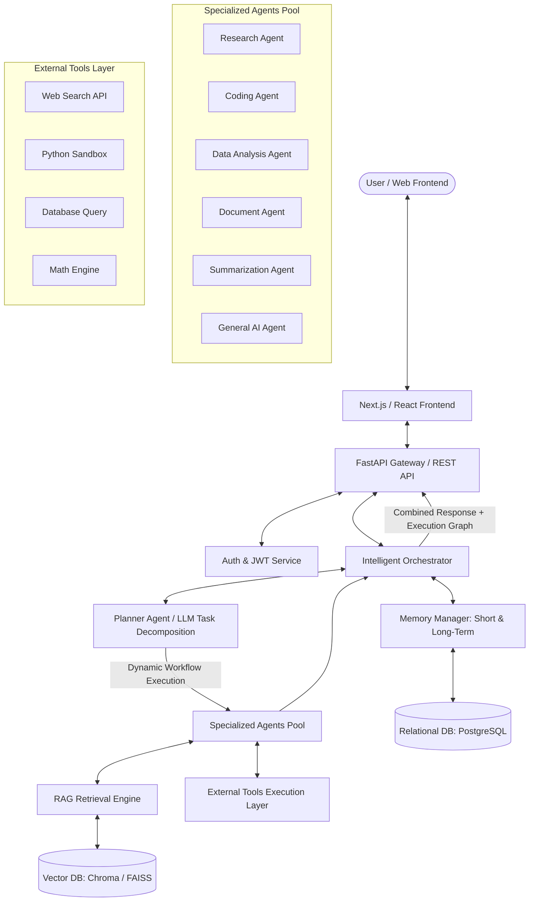
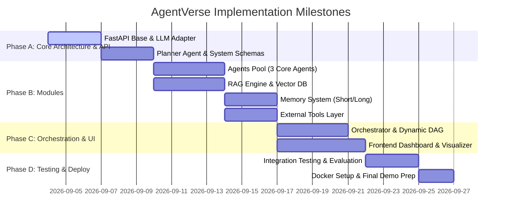

# AgentVerse: A Generic Multi-Agent Artificial Intelligence System
## Project Implementation Plan & 4-Developer Work Breakdown

---

## 📌 Executive Summary & Architecture Overview

The **AgentVerse System** is designed to provide a generic, context-aware, and explainable multi-agent artificial intelligence ecosystem. Unlike static single-agent chatbots or hardcoded agent chains, AgentVerse utilizes **Dynamic Orchestration**, where a **Planner Agent** evaluates user queries in real-time to decompose tasks and dynamically dispatch them across specialized agents, RAG engines, memory modules, and external execution tools.

### High-Level Architecture Diagram



---

## 🛠️ Technology Stack

| Layer / Component | Primary Technology | Description / Usage |
| :--- | :--- | :--- |
| **Frontend** | React / Next.js | Modern dashboard with Chat, Agent Matrix, & Dynamic Workflow Visualizer |
| **Backend API** | FastAPI (Python) | High-performance async REST API & WebSocket server |
| **Orchestration** | Custom Orchestrator / LangGraph | Dynamic multi-agent routing, DAG state management |
| **LLMs Engine** | Mistral / Llama (Ollama / VLLM / OpenRouter) | Core reasoning, planning, and task execution engine |
| **RAG & Embeddings** | Sentence-Transformers + Chroma / FAISS | Context retrieval from uploaded documents |
| **Databases** | PostgreSQL + pgvector | Short/Long-term conversation history, user state, system logs |
| **Execution Tools** | Python Subprocess / API Clients | Secure code execution, web search, CSV analysis |
| **DevOps & Deploy** | Docker + Docker Compose + GitHub Actions | Containerized microservices deployment |

---

## 📅 Project Phases Breakdown

### Phase 1 — Requirement & Architecture
- **User Interaction Flow**: User submits query $\rightarrow$ Frontend captures context $\rightarrow$ FastAPI Gateway $\rightarrow$ Orchestrator $\rightarrow$ Planner $\rightarrow$ Agent Execution $\rightarrow$ Result Aggregation $\rightarrow$ Dynamic Visualization.
- **Data & API Schemas**: JSON REST contracts for `/api/v1/chat`, `/api/v1/agents`, `/api/v1/documents`, `/api/v1/workflows`.

### Phase 2 — Basic AI Backend
- FastAPI skeleton setup with async endpoints.
- Integration with LLM provider (Ollama / HuggingFace / OpenAI API interface).
- Basic **Planner Agent** prompt/model setup for intent classification and query parsing.

### Phase 3 — Specialized Agents
- Modular implementation of agent abstractions (`BaseAgent`).
- Development of 5 core agents:
  1. **Research Agent**: Web search synthesis & domain knowledge extraction.
  2. **Coding Agent**: Scripting, syntax checks, & code generation.
  3. **Data Analysis Agent**: DataFrame handling, statistical computing, CSV processing.
  4. **Document / RAG Agent**: Deep doc querying & chunk context ingestion.
  5. **Summarization & General AI Agent**: Text condensation & broad reasoning.

### Phase 4 — Intelligent Orchestrator
- Dynamic DAG (Directed Acyclic Graph) executor.
- Handshake protocol between Planner and sub-agents.
- Conflict resolution, dynamic fallbacks, and multi-agent synthesis.

### Phase 5 — RAG Implementation
- Document Processing Pipeline: Loader $\rightarrow$ Text Cleaning $\rightarrow$ Recursive Chunking $\rightarrow$ Embeddings $\rightarrow$ Vector Store.
- Retriever module with top-$k$ similarity search and re-ranking for context feeding.

### Phase 6 — Memory System
- **Short-Term Memory**: Sliding window conversation buffer for active sessions.
- **Long-Term Memory**: Vectorized past interaction store with semantic search retrieval for user personalization.

### Phase 7 — External Tools Layer
- Tool execution environment with standard input/output interface (`BaseTool`).
- Web Search, Python Sandbox Executor, Calculator/Math Engine, File Parsers.

### Phase 8 — Dynamic Workflow Generation
- Conversion of Planner JSON output into execution steps.
- Conditional execution paths (e.g., Query $\rightarrow$ General Agent vs. Query $\rightarrow$ Data Agent + Python Tool $\rightarrow$ Summarizer).

### Phase 9 — Frontend & Visualizers
- **Chat Dashboard**: Dynamic streaming responses, message history, document drawer.
- **Agent Dashboard**: Live status of active agents, execution times, success rates.
- **Workflow Viewer**: Graphical tree/graph visualization of execution paths.

### Phase 10 — Testing & Evaluation
- Benchmarking accuracy, execution latency, retrieval precision, and hallucination rates.

### Phase 11 — Deployment & CI/CD
- Containerization with Docker Compose for local and server deployment.

---

## 👥 4-Developer Task & Role Assignment (WBS)

To maximize efficiency across the team of 4 developers, tasks are divided into clear domain responsibilities with modular boundary interfaces.

```
       ┌──────────────────────────────────────────────────────────┐
       │                PROJECT TEAM ALLOCATION                   │
       └────────────────────────────┬─────────────────────────────┘
                                    │
    ┌─────────────────┬─────────────┴───────┬──────────────────┐
    ▼                 ▼                     ▼                  ▼
┌──────────────┐ ┌──────────────┐   ┌──────────────┐   ┌──────────────┐
│  Developer 1 │ │  Developer 2 │   │  Developer 3 │   │  Developer 4 │
│ (Orchestrator│ │ (Agents &    │   │ (RAG, Memory │   │ (Frontend &  │
│  & Backend)  │ │  Tools Layer)│   │  & Database) │   │  Visualizers)│
└──────────────┘ └──────────────┘   └──────────────┘   └──────────────┘
```

### Developer 1: Core System Lead (Orchestrator & Backend Infrastructure)
**Primary Focus**: Core engine, FastAPI API layer, Planner agent, and execution flow.
- [ ] Setup FastAPI project structure, routing, middleware, CORS, and response models.
- [ ] Implement the **Planner Agent** prompt engineering and LLM response parsing into structured JSON DAGs.
- [ ] Build the **Intelligent Orchestrator** to handle async agent execution, state management, and final synthesis.
- [ ] Design dynamic workflow execution engine (Phase 4 & Phase 8).
- [ ] Lead system integration, API contracts, and Docker setup.

### Developer 2: Specialized Agents & External Tools Engineer
**Primary Focus**: Modular agent creation and tool sandboxing.
- [ ] Build `BaseAgent` abstract class and standard input/output interface formats.
- [ ] Implement **Research Agent**, **Coding Agent**, **Data Analysis Agent**, and **Summarization Agent**.
- [ ] Build `BaseTool` framework and build external execution tools:
  - Python execution sandbox tool.
  - Web search tool wrapper.
  - Calculator / math tool.
  - File processing tool (CSV/JSON parsers).
- [ ] Implement dynamic agent-tool binding and execution safety checks.

### Developer 3: Knowledge, Memory & Database Engineer
**Primary Focus**: RAG pipeline, vector stores, and memory systems.
- [ ] Set up PostgreSQL database schema for Users, Sessions, Conversations, and System Logs.
- [ ] Implement **Short-Term Memory Manager** (sliding conversation buffer).
- [ ] Implement **Long-Term Memory Manager** (semantic vector search over past session histories).
- [ ] Build the **RAG Pipeline**:
  - Document parser & cleaner (PDF, TXT, DOCX).
  - Chunking strategies & Sentence Transformer embedding generation.
  - Vector DB integration (ChromaDB / FAISS).
  - Context Retriever module for the Document/RAG Agent.

### Developer 4: UI/UX & Dynamic Visualization Frontend Engineer
**Primary Focus**: Next.js/React Frontend dashboard, dynamic workflow viewer, and agent monitor.
- [ ] Develop responsive **Chat Interface** supporting markdown rendering, dynamic code snippets, and file uploads.
- [ ] Build **Agent Monitoring Dashboard** showing live status, performance, execution latency, and success rates.
- [ ] Implement the **Interactive Workflow Viewer** (using React Flow / Cytoscape) to visualize live execution graphs (Planner $\rightarrow$ Agents $\rightarrow$ RAG $\rightarrow$ Tools).
- [ ] Connect Frontend to FastAPI via REST & WebSocket streams for real-time response generation.
- [ ] Design sleek, modern dark/glassmorphic UI aesthetics.

---

## 🚀 Minimum Viable Product (MVP) Roadmap & Execution Plan

If project timelines are constrained, complete the MVP core first before expanding to auxiliary features:



### MVP Core Flow (Milestone 1 Goal)
`User Query` $\rightarrow$ `FastAPI` $\rightarrow$ `Planner Agent` $\rightarrow$ `Dynamic Selection (3 Agents: General, RAG, Data)` $\rightarrow$ `RAG Context / Tools` $\rightarrow$ `Orchestrator Synthesis` $\rightarrow$ `Chat Dashboard`.
